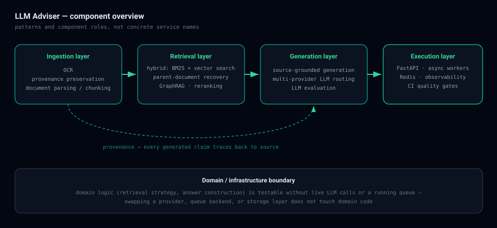

# Architecture

This describes *patterns and component roles*, not concrete service names, internal
hostnames, or endpoints. Everything below maps directly to the verified, already-public
scope of the role (résumé / GitHub profile) — nothing here claims implementation details
beyond that.

<picture>
  <source media="(prefers-color-scheme: dark)" srcset="../assets/architecture-dark.svg">
  <source media="(prefers-color-scheme: light)" srcset="../assets/architecture-light.svg">
  
</picture>

## Component overview

**Ingestion layer** — OCR for scanned/image-based sources, document parsing and
chunking, provenance preservation. Every chunk keeps a link back to its exact source
location, which is what makes downstream answers traceable rather than just plausible.

**Retrieval layer** — hybrid retrieval combining BM25 (keyword/lexical match) with
vector search (semantic match via embeddings), so the system covers both exact-term
queries ("which config flag controls X") and conceptual queries ("how does the service
handle retries") that keyword search alone would miss. Parent-document recovery expands
a matched fragment back out to its containing section before it reaches generation, so
answers aren't built on out-of-context snippets. GraphRAG and reranking sit on top of
this to improve relevance for queries that span related entities rather than a single
document.

**Generation layer** — source-grounded generation: the model is constrained to answer
from retrieved, provenance-tagged context rather than its own parametric knowledge, and
routes across multiple LLM providers rather than depending on a single vendor. LLM
evaluation runs as part of this layer, feeding the automated evaluation described in
[`evaluation.md`](evaluation.md).

**Execution layer** — FastAPI for the request path, asynchronous workers backed by
Redis for the ingestion/retrieval work that shouldn't block a request, observability
and security controls around all of it, and CI quality gates that run automated
evaluation on every change.

## Domain / infrastructure boundary

The platform separates **domain logic** (document processing rules, retrieval
strategy, answer construction) from **infrastructure** (queueing, provider routing,
persistence). This is one of the explicit design goals of the platform, not an
afterthought — it's what lets domain logic be tested without a live LLM call or a
running queue, and lets a provider, queue backend, or storage layer be swapped without
touching domain code.

> [!NOTE]
> The specific mechanism used to enforce this boundary in code (e.g. the exact module
> layout or dependency-injection approach) isn't detailed here — that's an
> implementation choice, not something this case study needs to disclose to make the
> architectural point.

## Deterministic document processing

Traditional RAG pipelines can produce different chunk boundaries or retrieval results
across repeated runs over the same document. Deterministic document processing means
the ingestion path produces the same provenance-tagged output for the same input every
time — a prerequisite for traceable, reproducible answers, and for CI to be able to
test the pipeline reliably at all.

## Traceable outputs

Every generated answer carries provenance back to its source documents, so a reader
verifies a claim instead of trusting it blindly — the same property that makes the
system's own automated evaluation possible (see [`evaluation.md`](evaluation.md)).

## Asynchronous execution

Ingestion and retrieval work that doesn't need to block a user-facing request runs on
async workers backed by Redis, keeping the request path responsive under load.

## Multi-provider LLM routing

The generation layer routes across multiple LLM providers rather than depending on one
— the standard reasons this matters for a production system are avoiding single-vendor
outage risk and enabling cost/latency trade-offs per query type. Which specific
providers are used isn't disclosed here, since that's an operational/commercial detail
of the institutional deployment rather than an architectural one.
